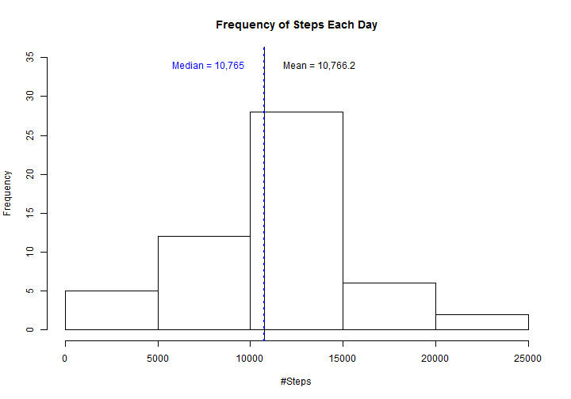
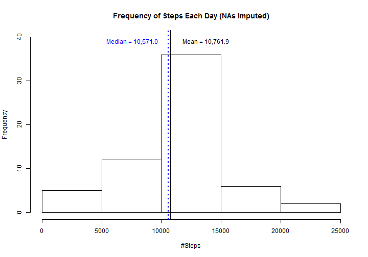

# Reproducible Research: Peer Assessment 1
========================================

This document analyzes the assigned human activity dataset and reports the 
requested information.

## Loading and preprocessing the data


Read in the data file and identify weekdays/weekends.

```r
activity <- read.csv("activity.csv")
activity$weekday <- weekdays(as.Date(activity$date))
activity$type <- rep("weekday", 17568)
activity$type[activity$weekday %in% c("Saturday", "Sunday")] <- "weekend"
```


## What is mean total number of steps taken per day?

```r
# First sum the steps by date, and drop NAs-->
byDate <- tapply(activity$steps[!is.na(activity$steps)], activity$date[!is.na(activity$steps)], 
    sum)
byDate <- byDate[!is.na(byDate)]
```


```r
# Next calculate the mean and median total number of steps taken per day -->
meanRaw <- round(mean(byDate), 1)
meanText <- formatC(meanRaw, format = "f", digits = 1, big.mark = ",")
medianRaw <- median(byDate)
medianText <- formatC(medianRaw, format = "d", big.mark = ",")
```

# The mean number of steps per day is 10,766.2 and the median is 10,765. 


```r
# Make a histogram of the total number of steps taken each day -->
hist(byDate, main = "Frequency of Steps Each Day", xlab = "#Steps", ylim = c(0, 
    35))
abline(v = meanRaw, col = "black")
text(x = meanRaw + 3000, y = 34, paste("Mean = ", meanText, sep = ""), col = "black")
abline(v = medianRaw, col = "blue", lwd = 2, lty = 3)
text(x = meanRaw - 3000, y = 34, paste("Median = ", medianText, sep = ""), col = "blue")
```




## What is the average daily activity pattern?

```r
# steps per interval, excluding NAs -->
byInterval <- as.numeric(tapply(activity$steps[!is.na(activity$steps)], activity$interval[!is.na(activity$steps)], 
    mean))
byIntervalWeekday <- round(as.numeric(tapply(activity$steps[!is.na(activity$steps) & 
    activity$type == "weekday"], activity$interval[!is.na(activity$steps) & 
    activity$type == "weekday"], mean)), 0)
byIntervalWeekend <- round(as.numeric(tapply(activity$steps[!is.na(activity$steps) & 
    activity$type == "weekend"], activity$interval[!is.na(activity$steps) & 
    activity$type == "weekend"], mean)), 0)

intervalVector <- as.integer(rownames(table(activity$interval)))
intervalTable <- data.frame(cbind(intervalVector, byInterval, byIntervalWeekday, 
    byIntervalWeekend))
colnames(intervalTable)[1] <- "interval"
summary(intervalTable)
```

```
##     interval      byInterval     byIntervalWeekday byIntervalWeekend
##  Min.   :   0   Min.   :  0.00   Min.   :  0.0     Min.   :  0.0    
##  1st Qu.: 589   1st Qu.:  2.49   1st Qu.:  2.0     1st Qu.:  1.0    
##  Median :1178   Median : 34.11   Median : 24.0     Median : 32.0    
##  Mean   :1178   Mean   : 37.38   Mean   : 35.3     Mean   : 43.1    
##  3rd Qu.:1766   3rd Qu.: 52.83   3rd Qu.: 52.0     3rd Qu.: 75.2    
##  Max.   :2355   Max.   :206.17   Max.   :234.0     Max.   :175.0
```


Identify the interval associated with the highest average number of steps

```r
intervals <- data.frame(as.integer(rownames(table(activity$interval))))
intervals <- cbind(intervals, byInterval)
colnames(intervals) <- c("interval", "steps")

maxInterval <- intervals[which(intervals$steps == max(intervals$steps)), ]
maxTime <- maxInterval[[1]]
maxHr <- floor(maxTime/100)
maxMin <- maxTime%%100
maxTimeText <- paste(paste(maxHr, ":", sep = ""), maxMin, sep = "")
maxSteps <- round(maxInterval[[2]], 1)
```

# The interval with the highest number of steps is the interval starting at 8:35, with an average of 206.2 steps. 


```r
plot(intervals$interval, intervals$steps, type = "l", xlab = "5-minute Interval", 
    ylab = "Steps", main = "Average Number of Steps Taken")
points(x = maxTime, y = maxSteps, col = "red", pch = 16)
text(x = maxTime + 300, y = maxSteps, paste("Max steps = ", maxSteps, sep = ""), 
    col = "black")
text(x = maxTime + 325, y = maxSteps - 10, paste("starting at ", maxTimeText, 
    sep = ""), col = "black")
```


## Imputing missing values
Note that there are a number of days/intervals where there are missing values 
(coded as NA). The presence of missing days may introduce bias into some 
calculations or summaries of the data.

Calculate and report the total number of missing values in the dataset (i.e. the total number of rows with NAs)


```r
TotalNAs <- length(activity$steps[!complete.cases(activity)])
```

# The activity dataset has 2304 NAs. 

Devise a strategy for filling in all of the missing values in the dataset. The 
strategy does not need to be sophisticated. For example, you could use the 
mean/median for that day, or the mean for that 5-minute interval, etc.

Create a new dataset that is equal to the original dataset but with the missing 
data filled in.


```r
# first subset data by type and whether steps is complete or NA
weekdayComplete <- activity[activity$type == "weekday" & !is.na(activity$steps), 
    ]
weekendComplete <- activity[activity$type == "weekend" & !is.na(activity$steps), 
    ]

dayIntervals <- as.integer(tapply(weekdayComplete$steps, weekdayComplete$interval, 
    mean))
endIntervals <- as.integer(tapply(weekendComplete$steps, weekendComplete$interval, 
    mean))

weekdayIncomplete <- activity[activity$type == "weekday" & is.na(activity$steps), 
    ]

# now impute missing steps as the mean for that interval and type in the
# complete data
weekdayIncomplete$rowlookup <- which(intervalTable$interval == as.numeric(weekdayIncomplete$interval))%%288
weekdayIncomplete$rowlookup[weekdayIncomplete$rowlookup == 0] <- 288
weekdayIncomplete$steps <- intervalTable$byIntervalWeekday[weekdayIncomplete$rowlookup]
weekdayIncomplete <- weekdayIncomplete[, 1:5]

weekendIncomplete <- activity[activity$type == "weekend" & is.na(activity$steps), 
    ]
weekendIncomplete$rowlookup <- which(intervalTable$interval == as.numeric(weekendIncomplete$interval))%%288
weekendIncomplete$rowlookup[weekendIncomplete$rowlookup == 0] <- 288
weekendIncomplete$steps <- intervalTable$byIntervalWeekend[weekendIncomplete$rowlookup]
weekendIncomplete <- weekendIncomplete[, 1:5]

# combine complete and incomplete date sets back into one data set
imputedActivity <- activity
imputedActivity <- rbind(weekdayComplete, weekdayIncomplete, weekendComplete, 
    weekendIncomplete)
```


Make a histogram of the total number of steps taken each day and Calculate and 
report the mean and median total number of steps taken per day. Do these values 
differ from the estimates from the first part of the assignment? What is the 
impact of imputing missing data on the estimates of the total daily number of 
steps?


```r
byDate2 <- tapply(imputedActivity$steps, imputedActivity$date, sum)
meanImputed <- round(mean(byDate2), 1)
meanImpText <- formatC(meanImputed, format = "f", digits = 1, big.mark = ",")
meanDiff <- round(meanImputed - meanRaw, 1)

medianImputed <- median(byDate2)
medianImpText <- formatC(medianImputed, format = "f", digits = 1, big.mark = ",")
medianDiff <- medianImputed - medianRaw

# Make a histogram of the total number of steps taken each day
hist(byDate2, main = "Frequency of Steps Each Day (NAs imputed)", xlab = "#Steps", 
    ylim = c(0, 40))
abline(v = meanImputed, col = "black")
text(x = meanImputed + 3000, y = 39, paste("Mean = ", meanImpText, sep = ""), 
    col = "black")
abline(v = medianImputed, col = "blue", lwd = 2, lty = 3)
text(x = medianImputed - 3000, y = 39, paste("Median = ", medianImpText, sep = ""), 
    col = "blue")
```



# Because I replaced NAs with the average #steps for that time interval in the same type of day - weekday or weekend - both the mean and median are slightly lower for the imputed data set than when NAs were simply ignored.


## Are there differences in activity patterns between weekdays and weekends?
First identify weekdays and weekends, then process their average pattern by
interval. Then combine the subsets back into a single data frame.

```r
weekends <- subset(imputedActivity, type == "weekend")
weekdays <- subset(imputedActivity, type == "weekday")

weekendInterval <- as.numeric(tapply(weekends$steps, weekends$interval, mean))
weekendInterval <- cbind(data.frame(as.numeric(rownames(table(activity$interval)))), 
    weekendInterval)
colnames(weekendInterval) <- c("interval", "steps")
weekendInterval$type <- "weekend"

weekdayInterval <- as.numeric(tapply(weekdays$steps, weekdays$interval, mean))
weekdayInterval <- cbind(data.frame(as.numeric(rownames(table(activity$interval)))), 
    weekdayInterval)
colnames(weekdayInterval) <- c("interval", "steps")
weekdayInterval$type <- "weekday"

weeksplit <- rbind(weekendInterval, weekdayInterval)
```


Now plot the observations in a single panel, using lattice.

```r
require("lattice")
xyplot(steps ~ interval | type, data = weeksplit, type = "l", main = "Avg. #Steps Taken", 
    xlab = "Interval", ylab = "Number of Steps", layout = c(1, 2))
```


# Clearly there are notable differences in the patterns of steps between those taken on weekdays and those taken on weekends. In particular, on weekdays, late mornings and early afternoons seem to have much fewer steps. Most likely, this is because the subject is sitting, presumably at work, on weekdays.
