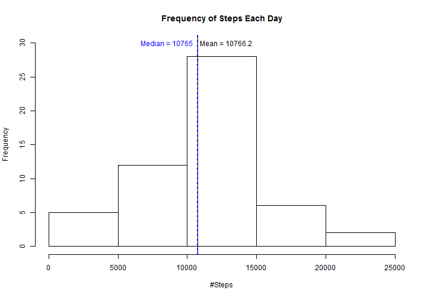
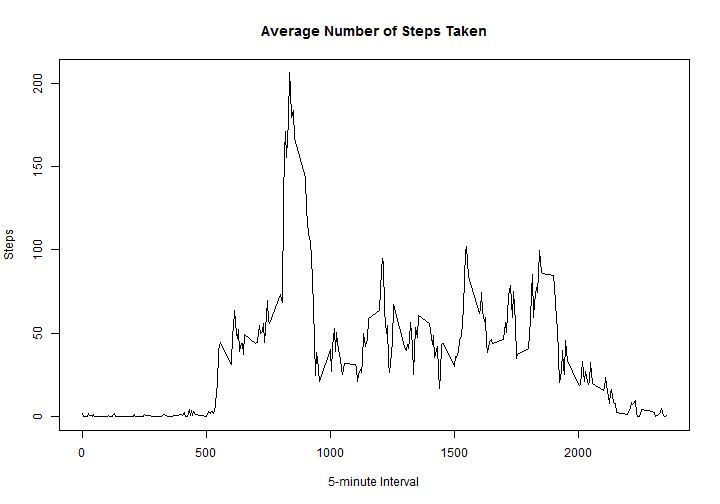
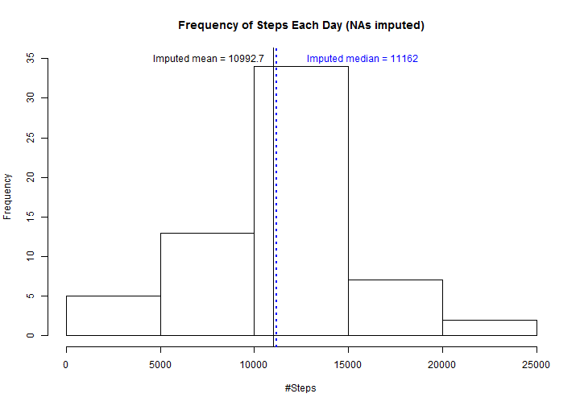
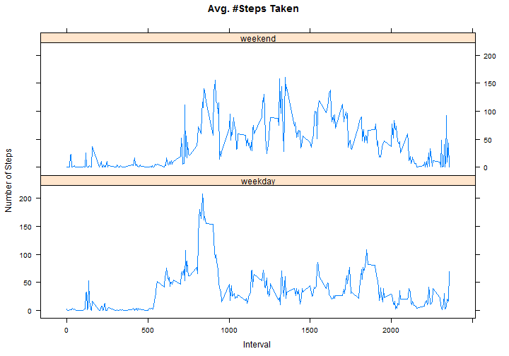

Reproducible Research Project 1: Summarize activity
================
  
This is an R Markdown document which summarizes aspects of personal movement 
activity data collected on an anonymous individual over 5-minute intervals in 
October and November 2007.


First, we read in the data.


```r
activity <- read.csv("activity.csv")
```

We wish to answer the question, **"What is mean total number of steps taken per 
day?"**

Let's start by using tapply to sum steps by day.

```r
byDate <- tapply(activity$steps[!is.na(activity$steps)], activity$date[!is.na(activity$steps)], 
    sum)
```

Let us remove NAs

```r
byDate <- byDate[!is.na(byDate)]
```


Next we calculate and report the mean and median total number of steps taken per
day


**The mean is 1.0766 &times; 10<sup>4</sup> and the median is 10765.**

Now we make a histogram of the total number of steps taken each day

```r
hist(byDate, main = "Frequency of Steps Each Day", xlab = "#Steps", ylim = c(0, 
    30))
abline(v = rawMean, col = "black", lwd = 1)
text(rawMean + 2050, 30, paste("Mean = ", rawMean, sep = ""), col = "black")
abline(v = rawMedian, col = "blue", lwd = 2, lty = 3)
text(rawMedian - 2250, 30, paste("Median = ", rawMedian, sep = ""), col = "blue")
```



Now we answer the question, **"What is the average daily activity pattern?"**

First we calculate the mean number of steps taken by interval across all days, 
using tapply. Then we plot the time series of average number of steps (y-axis) 
along 5-minute intervals (x-axis).


```r
byInterval <- as.numeric(tapply(activity$steps[!is.na(activity$steps)], activity$interval[!is.na(activity$steps)], 
    mean))
intervals <- data.frame(as.numeric(rownames(table(activity$interval))))
intervals <- cbind(intervals, byInterval)
colnames(intervals) <- c("interval", "steps")
par(mfrow = c(1, 1))
plot(intervals$interval, intervals$steps, type = "l", xlab = "5-minute Interval", 
    ylab = "Steps", main = "Average Number of Steps Taken")
```



Now we identify Which 5-minute interval, on average across all the days in the 
dataset, contains the maximum number of steps.


```r
maxTime <- intervals[which(intervals$steps == max(intervals$steps)), ][[1]]/100
```


**The 5-minute interval at 0:8.35 has the highest average number of steps,
206.2.**

_Imputing missing values_
Note that there are a number of days/intervals where there are missing values 
(coded as NA). The presence of missing days may introduce bias into some 
calculations or summaries of the data.

First let us calculate and report the total number of missing values in the 
dataset (i.e. the total number of rows with NAs)


**The total number of NAs is 2304.**

Now we devise a strategy for filling in all of the missing values in the 
dataset. The strategy does not need to be sophisticated. For example, we could 
use the mean/median for that day, or the mean for that 5-minute interval, etc.

Create a new dataset that is equal to the original dataset but with the missing 
data filled in.

While we do not HAVE to use a sophisticated strategy, I choose to use one: I 
will use the package mice: Multivariate Imputation by Chained Equations.

Let us call the new dataset imputedActivity.

NOTE: This will take a few minutes to run, depending on your system.

```
## Loading required package: mice
```

```
## Warning: package 'mice' was built under R version 3.0.3
```

```
## Loading required package: Rcpp
```

```
## Warning: package 'Rcpp' was built under R version 3.0.3
```

```
## mice 2.21 2014-02-05
```

```
## 
##  iter imp variable
##   1   1  steps
##   1   2  steps
##   1   3  steps
##   1   4  steps
##   1   5  steps
##   2   1  steps
##   2   2  steps
##   2   3  steps
##   2   4  steps
##   2   5  steps
##   3   1  steps
##   3   2  steps
##   3   3  steps
##   3   4  steps
##   3   5  steps
##   4   1  steps
##   4   2  steps
##   4   3  steps
##   4   4  steps
##   4   5  steps
##   5   1  steps
##   5   2  steps
##   5   3  steps
##   5   4  steps
##   5   5  steps
```


Now we calculate and report the mean and median total number of steps taken per 
day, and plot a histogram of steps per day. 

```r
byDate2 <- tapply(imputedActivity$steps, imputedActivity$date, sum)

meanImputed <- round(mean(byDate2), 1)
meanIncrease <- round(meanImputed - rawMean, 1)

medianImputed <- median(byDate2)
medianIncrease <- medianImputed - rawMedian

hist(byDate2, main = "Frequency of Steps Each Day (NAs imputed)", xlab = "#Steps", 
    ylim = c(0, 35))
abline(v = meanImputed, col = "black", lwd = 1)
text(rawMean - 3200, 35, paste("Imputed mean = ", meanImputed, sep = ""), col = "black")
abline(v = medianImputed, col = "blue", lwd = 2, lty = 3)
text(rawMedian + 5000, 35, paste("Imputed median = ", medianImputed, sep = ""), 
    col = "blue")
```



**The new mean is 1.0993 &times; 10<sup>4</sup>, which is larger than the previously calculated
mean by 226.5. The new median is 11162, which is larger 
than the previous calculation by 397.

In this case, the impact of imputing missing data on the estimates of the total 
daily number of steps was it increased them.**

Next we examine whether there are differences in activity patterns between 
weekdays and weekends.

First let's create some subsets of the imputed data depending on whether the day
is a weekday or on a weekend.

```r
weekday <- weekdays(as.Date(imputedActivity$date))
imputedActivity$weekday <- rep("weekday", 17568)
imputedActivity$weekday[weekday %in% c("Saturday", "Sunday")] <- "weekend"
weekends <- subset(imputedActivity, weekday == "weekend")
weekdays <- subset(imputedActivity, weekday == "weekday")
```


Now let's use tapply to find the mean number of steps by interval within both
subsets.

```r
weekendInterval <- as.numeric(tapply(weekends$steps, weekends$interval, mean))
weekendInterval <- cbind(data.frame(as.numeric(rownames(table(activity$interval)))), 
    weekendInterval)
colnames(weekendInterval) <- c("interval", "steps")
weekendInterval$type <- rep("weekend", nrow(weekendInterval))

weekdayInterval <- as.numeric(tapply(weekdays$steps, weekdays$interval, mean))
weekdayInterval <- cbind(data.frame(as.numeric(rownames(table(activity$interval)))), 
    weekdayInterval)
colnames(weekdayInterval) <- c("interval", "steps")
weekdayInterval$type <- rep("weekday", nrow(weekdayInterval))
```


Finally we can combine the subsets back into a single data frame to use as the
basis for our plot.

```r
weeksplit <- rbind(weekendInterval, weekdayInterval)
```


```
## Loading required package: lattice
```

```
## Warning: package 'lattice' was built under R version 3.0.3
```


Let's use lattice's xyplot, plotting steps as a function of interval, grouped by
type of day, weekday or weekend.

```r
# xy plots by factor level
xyplot(steps ~ interval | type, data = weeksplit, type = "l", main = "Avg. #Steps Taken", 
    xlab = "Interval", ylab = "Number of Steps", layout = c(1, 2))
```



